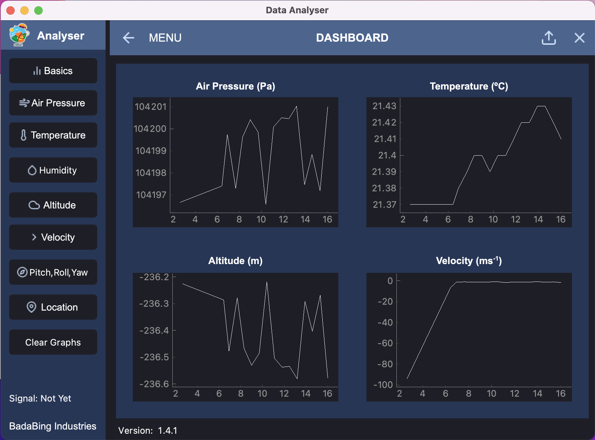

# Data Client for CanSat


## Table of Contents
* [Overview](#Overview)
* [Setup](#Setup)

## Overview
This is the data client I created and was used for the CanSat competition.

## Setup
It's reccommended you use a virtual environment to store your python settings, however it's not required.
To install the required libraries, run:

```
$ pip install -r requirements.txt
```

If editing the .ui file, to turn the interface into an executable python file run:

```
$ pyuic5 -x interface_file.ui -o name_of_executable.py
```
## What does this do?
Our CanSat Data Analyser displays the most recent data from the satellite on the home screen.
If you want to see the full data for a specified characteristic, simply go to the side bar and click on it.

You can also save sections of the data by clicking on the top right save button and stop saving data by the other icon.
